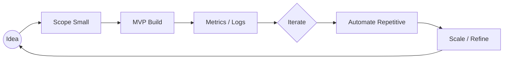

<!--
README Styling Guide:
- 余計な外部リクエストが多いと読み込みが重くなるので必要に応じてコメントアウトして調整してください。
- SVGバナーやアニメーションは自作して差し替え可能です。
-->

<p align="center">
  <!-- Hero Banner (差し替え推奨) -->
  
</p>

<p align="center">
  
</p>

<p align="center">
  <strong>学生エンジニア / Discord Bot / Web & API / Next.js</strong><br/>
  <em>Ship fast. Learn faster.</em>
</p>

<p align="center">
  <a href="https://github.com/HTMLTiv">
    
  </a>
  <a href="https://github.com/HTMLTiv?tab=followers">
    
  </a>
  
</p>

---

## 🪄 About

> 2006年1月26日生。主にPythonを使用し、LLM（Large Language Models）にも触れています。自宅サーバー（Proxmox VE）でインフラを管理し、仮想マシン・LXCコンテナ・ストレージ・ネットワークを運用しています。サーバサイドからフロント、Bot、オートメーションまで。

| Key | Value |
|-----|-------|
| 主軸 | Python / LLM / Discord Bot / API連携 / Webフルスタック |
| 得意 | 素早いプロトタイプ → 計測 → 改善 |
| スタイル | シンプルなコア + モジュール化 + 自動化 |
| 連絡 | muzui122530@gmail.com |
| 発信 |  GitHub |
| モットー | Build → Ship → Learn → Iterate |

---

## 🧰 Tech Stack

### Core Languages


### Frameworks & Runtime


### Infra / Data / Ops


### Tooling / Design


---

## 🔭 Focus Areas (2025)

| Theme | 内容 | 現在の打ち手 |
|-------|------|-------------|
| Python Development | スクリプト / 自動化 / データ処理 | 効率的なコード最適化 |
| LLM Integration | AIモデル連携 / チャットボット / 分析 | OpenAI API / Hugging Face 実験 |
| Discord Bot | 多言語化 / 権限管理 / 分析 | Eventログ → 可観測性 |
| Next.js + API | ダッシュボード / Bot管理UI | App Router + Edge 実験 |
| Infrastructure | 自宅サーバー管理 / Proxmox VE / 仮想化 | VM・LXCコンテナ運用 / バックアップ・監視 / ネットワーク設定 |
| Automation | CI + 型検査 + Release | GitHub Actions 最適化 |
| Observability | レイテンシ計測 / ログ整形 | Structured Logging |
| Learning | Rust / Edge Functions | 小さなユースケース積み上げ |

---

## 🧪 Code Micro Samples

<details>
<summary><strong>Next.js (App Router) - Edge Ready API Route</strong></summary>

```ts
// app/api/health/route.ts
export const runtime = 'edge';

export async function GET() {
  return new Response(JSON.stringify({ status: 'ok', time: Date.now() }), {
    headers: { 'Content-Type': 'application/json' }
  });
}
```
</details>

<details>
<summary><strong>Discord.js Interaction Handler (Pattern)</strong></summary>

```ts
import { ChatInputCommandInteraction } from 'discord.js';

export async function handlePing(interaction: ChatInputCommandInteraction) {
  const started = performance.now();
  await interaction.reply({ content: '🏓 Pong!', ephemeral: true });
  const ms = performance.now() - started;
  console.log('[PING]', ms.toFixed(2), 'ms');
}
```
</details>

<details>
<summary><strong>FastAPI Minimal Service</strong></summary>

```python
from fastapi import FastAPI
app = FastAPI()

@app.get("/metrics")
def metrics():
    return {"uptime_sec": 1234, "version": "0.1.0"}
```
</details>

<details>
<summary><strong>Python LLM Integration (OpenAI)</strong></summary>

```python
import openai

def generate_response(prompt: str) -> str:
    response = openai.ChatCompletion.create(
        model="gpt-3.5-turbo",
        messages=[{"role": "user", "content": prompt}]
    )
    return response.choices[0].message.content

# Example usage
result = generate_response("Hello, how are you?")
print(result)
```
</details>

<details>
<summary><strong>Rails Controller Snippet</strong></summary>

```ruby
class HealthController < ApplicationController
  def index
    render json: { ok: true, time: Time.now.utc.iso8601 }
  end
end
```
</details>

---

## 🔄 Workflow Philosophy



- 余計な抽象化は後回し
- 計測できない改善は"感想"
- 先に価値を届けてフィードバック最速化

---

## 🤝 Work / Collab

| 提供できること | 例 |
|----------------|----|
| Python Development | スクリプト作成 / データ処理 / 自動化 |
| LLM Integration | AIチャットボット / テキスト生成 / API連携 |
| Discord Bot | 多機能管理 / 分析 / API連携 |
| Web / Dashboard | Next.js + API 統合UI |
| Infrastructure | 自宅サーバー構築 / Proxmox仮想化 / VM・LXC管理 / バックアップ・監視 |
| Automation | CI/CD・型チェック・Lint整備 |
| API連携 | Discord / OpenAI 等 |
| MVP構築 | 要件整理 → 最小実装 → 改善 |

> 小さなスパンでアウトプット → 進捗可視化を重視しています。

📬 連絡: **muzui122530@gmail.com**

---


## 🛠 Quick Scripts (Idea)

```bash
# update-all (例) : 依存を一括安全更新
for d in $(ls -d */); do
  (cd "$d" && [ -f package.json ] && npm update)
done
```

---
